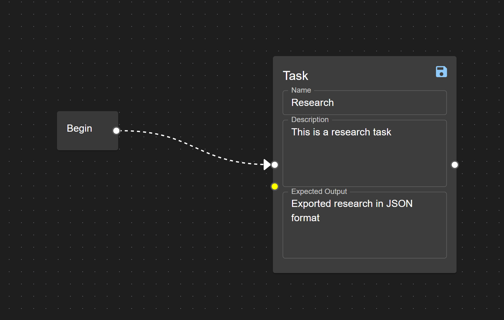

# CrewAI Visual Editor

A visual node-based editor for creating and managing CrewAI crews. This tool allows you to visually design your agent crews, define tasks, and export them directly from the interface.

## Features

- Drag-and-drop interface for creating crews
- Visual task and agent node creation
- Real-time crew visualization
- YAML export functionality
- Python crew.py export functionality

## Getting Started

### Prerequisites

- Node.js (v20 or higher)
- npm or yarn
- Python 3.10+ (for future extensions)

### Installation

1. Clone the repository:
```bash
git clone [your-repo-url]
cd crew-editor
```

2. Install dependencies:
```bash
npm install
# or
yarn
```

3. Start the development server:
```bash
npm run dev
# or
yarn dev
```

4. Open your browser and navigate to `http://localhost:5173`

## Usage Instructions

This section will guide you through the process of using the CrewAI Visual Editor to create a simple crew setup. Follow these steps to get started:

### First: Install CrewAI ###

Follow the instructions in the [CrewAI documentation](https://docs.crewai.com/installation) to install CrewAI and run your crew.

### Step 1: Add a Begin Node

1. Open the CrewAI Visual Editor in your browser.
2. Drag a **Begin Node** from the sidebar onto the canvas.


### Step 2: Add a Task Node

1. Drag a **Task Node** from the sidebar onto the canvas.
2. Connect the **Begin Node** to the **Task Node** by dragging from the handle on the right of the Begin Node to the handle on the left of the Task Node.



### Step 3: Add an Agent Node

1. Drag an **Agent Node** from the sidebar onto the canvas.
2. Connect the **Agent Node** to the **Task Node** by dragging from the handle on the right of the Agent Node to the handle on the left of the Task Node.


### Step 4: Fill in Node Details

1. Fill in the required fields for each node:
   - **Task Node**: Name, Description, Expected Output
   - **Agent Node**: Name, Role, Goal, Backstory, Tools (comma separated list)

### Step 5: Export YAML and Python Scripts

1. Use the menu bar at the top of the editor to export your setup.
2. Click on **YAML Export** to generate a YAML file of your current setup.
3. Click on **Python Export** to generate a Python script of your current setup.


- Once you have completed these steps, you will have a basic crew setup ready for further development or deployment. Copy and paste the YAML into your agents.yaml and tasks.yaml files.
- Copy and paste the Python script into your crew.py file.
- You can save agents and tasks to the sidebar to reuse them later, by clicking the disk icon in the top right corner of each node.
- You can save and load your graphs by clicking the save/load icon in the top right corner of the page.

## Development

This project is built with:
- React + TypeScript
- Vite
- React Flow
- Material-UI


## License

MIT